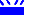

Описание системы
================

## Введение

TODO

## Требования

Для функционирования системы необходимо... TODO

Полная спецификация использованного оборудования приведена в файле [SPECIFICATION.md](SPECIFICATION.md).

## Возможности

### Контроль нескольких групп датчиков протечки

Система позволяет контролировать несколько групп датчиков, разнесённых территориально, например по разным помещениям, но запитываемых от одних и тех же стояков ХВС/ГВС.

Группа датчиков состоит из одного или более датчиков одного типа включенных параллельно.

В данный момент, используется 8 групп датчиков (все входы контроллера без платы расширения).
Если необходимо использовать больше или меньше групп, то необходимо указать желаемое значение в
константе

    # максимальное количество групп датчиков
    const MAX_SENSORS = 8;

Единственное требование, чтобы под датчики был использован непрерывный кусок набора входов начиная с первого входа. Иначе могут быть коллизии, если в группу датчиков протечки подключен какой-либо другой и он будет находиться в активном состоянии. В этом случае, будет дана команда исполнительному механизму на перекрытие воды.

Можно использовать входы без подключения датчиков, в таком случае они всегда будут в пассивном состоянии и не будут оказывать влияния.

Так же можно отключить вход, к которому подключен датчик протечки. Это можно добиться галочкой **Разрешено** в настройках входа. В этом случае, вход также будет всегда в пассивном состоянии и не будет оказывать влияния. Может потребоваться, если необходимо игнорировать состояние входа в виду неисправности датчика или его недоступности (течи уже нет, но датчик в воде и отсутствует возможность просушить место установки датчика и сам датчик).

Для отображения статуса тревоги используется индикатор **ALM** () с необходимой программой включения, позволяющий визуально понять состояние.

### Техническое обслуживание приводов кранов

Для приводов кранов проводится периодическое (раз в неделю) обслуживание для предотвращения их "закисания". Константами в коде логики можно указать день недели, час и минуту начала обслуживания.

    # воскресенье, 01:05
    const MNT_HOUR          = 1;
    const MNT_MINUTE        = 5;
    const MNT_DOW           = 7;

Техническое обслуживание пропускается, если в момент его наступления имется протечка (сработал датчик(и) в одной или нескольких группах.

Техническое обслуживание прекращается, если в момент его работы сработал один или несколько датчиков.

Для отображения статуса обслуживания используется индикатор **MNT** () с необходимой программой включения, позволяющий визуально понять состояние.

### Отложенное открытие кранов

В случае устранения протечки, сигнал на открытие кранов подаётся не сразу, а спустя некоторое время, задаваемое константой

	const PERIOD_GRACE      = PERIOD_30;    # отсрочка 30 сек

На индикаторе **ALM** () отображается соответствующая программа. По завершении периода, подаётся сигнал на открытие кранов.

### Режим тишины

Для продотвращения получения звонков/сообщений от контроллера, предусмотрены пара констант, позволяющих указать интервал (час начала и час окончания), когда звонки/сообщения будут подавляться. При этом все необходимые действия будет выполнены.

	const MUTE_FROM         = 22;           # > 22:00
	const MUTE_TILL         = 9;            # < 09:00

Это касается системных событий (отключение/восстановление внешнего питания, разряд батареи и прочие).

### Ручной режим управления приводами кранов

Кроме автоматического управления открытием/закрытием кранов, имеется возможность управлять ими в ручном режиме. Для этого служит пара переключателей:

* **MODE** - выбор режима ("M" / "A")
* **VALVE** - управление кранами ("O" / "C").

Индикация состояния кранов (открыты или закрыты) отображается в обоих режимах соответствующими индикаторами.

При переводе в ручной режим управления, приводы кранов не будет реагировать на команды контроллера. Он будет работать в штатном режиме (реагировать на изменения состояния датчиков протечки, выполнять техническое обслуживание и пр.), однако шаровые приводы кранов не будут исполнять его команды.

## Приципиальные схемы

### Индикатор состояния кранов

Индикатор располагается в месте коммутации датчиков и кранов (скорее всего туалетная комната) и служит для визуализации состояния приводов кранов (предполагаемое состояние). Он исключает необходимость хождения к электрощиту, где располагаются основные индикаторы состояния.

Схема индикатора доступна в формате DipTrace Schematic Capture v3.0+: `schemes/indicator_unit.dch`.

Может быть реализована как поверхностным монтажом (Surface Mount Technology), так и классическим (Through-hole Technology). В таблице компонентов (на схеме) приведены ориентировочные аналоги компонентов для обоих технологий.

Принципиальная схема индикатора

Индикатор питается напряжением `+5V`, которое необходимо подать на вывод 1 разъёма. Вывод 2 разъёма должен быть подключен к проводу **OUT** привода крана.

## События

TODO

## Сценарии логики

### Общие приципы

Сценарии, основанные на коде Морзе запускаются и останавливаются по событиям. Приняты следующие длительности интервалов для кодирования знаков.

Интервал                        | Такты | Время, мс | Элемент
------------------------------- | ----- | --------- | -------
Элемент знака "тире"            | 8     | 800       | 
Элемент знака "точка"           | 4     | 400       | 
Пауза между элементами знака    | 2     | 200       |
Пауза до начала повтора знака   | 8     | 800       |

Для каждого сценария, если дополнительно не указано иное, необходимо установить параметры (галочки):

* **бесконечное** число повторений;
* **высокий** начальный уровень сигнала;

### Сценарий \#1 (`$SCENARIO1`)

Код Морзе цифры **1** (один)

##### Столбцы тактов

столбец | 1   | 2   | 3   | 4   | 5   | 6   | 7   | 8   | 9   | 10
------- | --- | --- | --- | --- | --- | --- | --- | --- | --- | ---
такты   | 4   | 2   | 8   | 2   | 8   | 2   | 8   | 2   | 8   | 10

##### Использование

Индикатор тревоги **ALM** ().

##### Фактической смысл

Сработал датчик протечки из группы датчиков 1.

### Сценарий \#2 (`$SCENARIO2`)

Код Морзе цифры **2** (два)

##### Столбцы тактов

столбец | 1   | 2   | 3   | 4   | 5   | 6   | 7   | 8   | 9   | 10
------- | --- | --- | --- | --- | --- | --- | --- | --- | --- | ---
такты   | 4   | 2   | 4   | 2   | 8   | 2   | 8   | 2   | 8   | 10

##### Использование

Индикатор тревоги **ALM** ().

##### Фактической смысл

Сработал датчик протечки из группы датчиков 2.

### Сценарий \#3 (`$SCENARIO3`)

Код Морзе цифры **3** (три)

##### Столбцы тактов

столбец | 1   | 2   | 3   | 4   | 5   | 6   | 7   | 8   | 9   | 10
------- | --- | --- | --- | --- | --- | --- | --- | --- | --- | ---
такты   | 4   | 2   | 4   | 2   | 4   | 2   | 8   | 2   | 8   | 10

##### Использование

Индикатор тревоги **ALM** ().

##### Фактической смысл

Сработал датчик протечки из группы датчиков 3.

### Сценарий \#4 (`$SCENARIO4`)

Код Морзе цифры **4** (четыре)

##### Столбцы тактов

столбец | 1   | 2   | 3   | 4   | 5   | 6   | 7   | 8   | 9   | 10
------- | --- | --- | --- | --- | --- | --- | --- | --- | --- | ---
такты   | 4   | 2   | 4   | 2   | 4   | 2   | 4   | 2   | 8   | 10

##### Использование

Индикатор тревоги **ALM** ().

##### Фактической смысл

Сработал датчик протечки из группы датчиков 4.

### Сценарий \#5 (`$SCENARIO5`)

Код Морзе цифры **5** (пять)

##### Столбцы тактов

столбец | 1   | 2   | 3   | 4   | 5   | 6   | 7   | 8   | 9   | 10
------- | --- | --- | --- | --- | --- | --- | --- | --- | --- | ---
такты   | 4   | 2   | 4   | 2   | 4   | 2   | 4   | 2   | 4   | 10

##### Использование

Индикатор тревоги **ALM** ().

##### Фактической смысл

Сработал датчик протечки из группы датчиков 5.

### Сценарий \#6 (`$SCENARIO6`)

Код Морзе цифры **6** (шесть)

##### Столбцы тактов

столбец | 1   | 2   | 3   | 4   | 5   | 6   | 7   | 8   | 9   | 10
------- | --- | --- | --- | --- | --- | --- | --- | --- | --- | ---
такты   | 8   | 2   | 4   | 2   | 4   | 2   | 4   | 2   | 4   | 10

##### Использование

Индикатор тревоги **ALM** ().

##### Фактической смысл

Сработал датчик протечки из группы датчиков 6.

### Сценарий \#7 (`$SCENARIO7`)

Код Морзе цифры **7** (семь)

##### Столбцы тактов

столбец | 1   | 2   | 3   | 4   | 5   | 6   | 7   | 8   | 9   | 10
------- | --- | --- | --- | --- | --- | --- | --- | --- | --- | ---
такты   | 8   | 2   | 8   | 2   | 4   | 2   | 4   | 2   | 4   | 10

##### Использование

Индикатор тревоги **ALM** ().

##### Фактической смысл

Сработал датчик протечки из группы датчиков 7.

### Сценарий \#8 (`$SCENARIO8`)

Код Морзе цифры **8** (восемь)

##### Столбцы тактов

столбец | 1   | 2   | 3   | 4   | 5   | 6   | 7   | 8   | 9   | 10
------- | --- | --- | --- | --- | --- | --- | --- | --- | --- | ---
такты   | 8   | 2   | 8   | 2   | 8   | 2   | 4   | 2   | 4   | 10

##### Использование

Индикатор тревоги **ALM** ().

##### Фактической смысл

Сработал датчик протечки из группы датчиков 8.

### Сценарий \#10 (`$SCENARIO10`)

Код Морзе буквы **W** (латиница): **W**orking

##### Столбцы тактов

столбец | 1   | 2   | 3   | 4   | 5   | 6
------- | --- | --- | --- | --- | --- | ---
такты   | 4   | 2   | 8   | 2   | 8   | 10

##### Использование

Индикатор технического обслуживания приводов кранов **MNT** ().

##### Фактической смысл

Техническое обслуживание приводов кранов проходит в штатном режиме.

### Сценарий \#11 (`$SCENARIO11`)

Код Морзе буквы **S** (латиница): **S**kipping

##### Столбцы тактов

столбец | 1   | 2   | 3   | 4   | 5   | 6
------- | --- | --- | --- | --- | --- | ---
такты   | 4   | 2   | 4   | 2   | 4   | 10

##### Использование

Индикатор технического обслуживания приводов кранов **MNT** ().

##### Фактической смысл

Техническое обслуживание приводов кранов отменено из-за активности датчиков протечки.

### Сценарий \#12 (`$SCENARIO12`)

Код Морзе буквы **D** (латиница): wrong **D**ay of week

##### Столбцы тактов

столбец | 1   | 2   | 3   | 4   | 5   | 6
------- | --- | --- | --- | --- | --- | ---
такты   | 8   | 2   | 4   | 2   | 4   | 10

##### Использование

Индикатор технического обслуживания приводов кранов **MNT** ().

##### Фактической смысл

Техническое обслуживание приводов кранов не будет выполняться из-за неверного дня недели.

### Сценарий \#13 (`$SCENARIO13`)

Код Морзе буквы **X** (латиница): e**X**iting

##### Столбцы тактов

столбец | 1   | 2   | 3   | 4   | 5   | 6   | 7   | 8
------- | --- | --- | --- | --- | --- | --- | --- | ---
такты   | 8   | 2   | 4   | 2   | 4   | 2   | 8   | 10

##### Использование

Индикатор технического обслуживания приводов кранов **MNT** ().

##### Фактической смысл

Техническое обслуживание приводов кранов прекращено из-за срабатывания датчиков протечки.

### Сценарий \#14 (`$SCENARIO14`)

Код Морзе буквы **G** (латиница): **G**race period

##### Столбцы тактов

столбец | 1   | 2   | 3   | 4   | 5   | 6
------- | --- | --- | --- | --- | --- | ---
такты   | 8   | 2   | 8   | 2   | 4   | 10

##### Использование

Индикатор тревоги **ALM** ().

##### Фактической смысл

Действует режим отсрочки запуска приводов кранов на открытие.

## Лицензия

MIT

[http://opensource.org/licenses/MIT](http://opensource.org/licenses/MIT)
